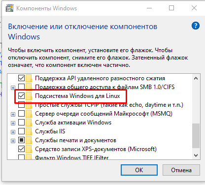

# Руководство по развёртыванию Проекта в Docker

## 1. Краткое описание

Это Laravel-проект, работающий в Docker-контейнерах. После развертывания вам нужно:

- Настроить и скопировать файл окружения `.env`.
- Установить зависимости (через контейнер или на хосте при необходимости).
- Запустить контейнеры.
- Выполнить миграции базы данных.
- Зарегистрироваться в системе, чтобы воспользоваться функционалом проекта.

---

## 2. Развёртывание на Linux (Ubuntu)

### 2.1 Установить Docker и Docker Compose

```bash
sudo apt-get update
sudo apt-get install -y ca-certificates curl gnupg lsb-release

# Добавляем ключи GPG
curl -fsSL https://download.docker.com/linux/ubuntu/gpg | sudo gpg --dearmor -o /usr/share/keyrings/docker-archive-keyring.gpg

# Добавляем репозиторий Docker
echo   "deb [arch=$(dpkg --print-architecture) signed-by=/usr/share/keyrings/docker-archive-keyring.gpg]   https://download.docker.com/linux/ubuntu   $(lsb_release -cs) stable" | sudo tee /etc/apt/sources.list.d/docker.list > /dev/null

# Устанавливаем Docker
sudo apt-get update
sudo apt-get install -y docker-ce docker-ce-cli containerd.io docker-compose-plugin

# (Опционально) разрешить запуск Docker без sudo
sudo groupadd docker
sudo usermod -aG docker $USER
newgrp docker
```

Примечание: Убедитесь, что Docker установлен корректно, выполнив:

```bash
docker --version
```

### 2.2 Клонировать репозиторий проекта

```bash
git clone <git@github.com:RamanDudoits/shortLink.git> project
cd project
```

### 2.3 Создать файл .env

```bash
cp .env.example .env
# Открываем .env и меняем DB_HOST, DB_DATABASE, DB_USERNAME, DB_PASSWORD, и т.д. (при необходимости)
```

### 2.4 Запустить Docker-контейнеры

```bash
docker-compose up -d
```

### 2.5 Установка зависимостей

```bash
docker-compose exec app composer install
```

### 2.6 Выполнить миграции

```bash
docker-compose exec app php artisan migrate
```

---

## 3. Развёртывание на Windows

### 3.1 Установка Docker Desktop, WSL и Hyper-V

**Установить WSL (Windows Subsystem for Linux):**

```powershell
wsl --install
```

Перезагрузите компьютер.

**Включить Hyper-V:**

```powershell
dism.exe /online /enable-feature /featurename:Microsoft-Hyper-V /all /limitaccess /norestart
```

**Включение Hyper-V через Графический интерфейс Windows:**

- Откройте Панель управления (Win + R → введите appwiz.cpl → нажмите Enter).
- Выберите "Программы"
- Перейдите в Включение или отключение компонентов Windows (слева в меню).
- Найдите и установите флажок напротив Hyper-V.
- Нажмите ОК и дождитесь установки.
- Перезагрузите компьютер.


Перезагрузите компьютер.

**Или если у вас домашняя версия**

- Сделайте те же шаги
- включите "Подсистема Windows для Linux"


## Полезные команды для wsl

### Включение WSL
wsl --install

### Проверка установленных дистрибутивов
wsl --list --verbose

### Установка Ubuntu
wsl --install -d Ubuntu

### Установка через Microsoft Store:
- 1. Открыть Microsoft Store
- 2. Найти "Ubuntu" или "Debian"
- 3. Нажать "Установить"

### Установка WSL 2 (если не установлено)
wsl --set-default-version 2
wsl --update

### Запуск WSL
wsl

### Проверка всех установленных дистрибутивов
wsl --list --verbose

### Переключение версии WSL
wsl --set-version Ubuntu 2

### Перезапуск WSL
wsl --shutdown

### Удаление WSL (если нужно)
wsl --unregister Ubuntu


**Установить Docker Desktop**

1. Скачайте и установите последнюю версию Docker Desktop для Windows.
2. В настройках включите:
    - "Use WSL 2 based engine"
    - "Enable integration with my default WSL distro"

### 3.2 Запуск проекта

```bash
git clone <git@github.com:RamanDudoits/shortLink.git> project
cd project
cp .env.example .env
```

**Запустить контейнеры:**

```bash
docker-compose up -d
```

**Установка зависимостей:**

```bash
docker-compose exec app composer install
```

**Выполнить миграции:**

```bash
docker-compose exec app php artisan migrate
```

Откройте в браузере `http://localhost:8876/`.

---

## 4. Дополнительные советы

**Проверка состояния контейнеров:**

```bash
docker-compose ps
docker ps
```

**Остановка контейнеров:**

```bash
docker-compose down
```

**Пересборка контейнеров:**

```bash
docker-compose build
docker-compose up -d
```

**Настройка `.env` файла:**

- Убедитесь, что корректно указаны переменные `DB_HOST`, `DB_DATABASE`, `DB_USERNAME`, `DB_PASSWORD`.
- Их можно найти в `docker-compose.yml`
- Если порт или пути для приложений отличаются, укажите их в `.env`.

---

Поздравляю! Теперь Laravel-приложение развернуто с помощью Docker.

***disclaimer***
#### Это руководство подразумевает что вы работали с Linux
